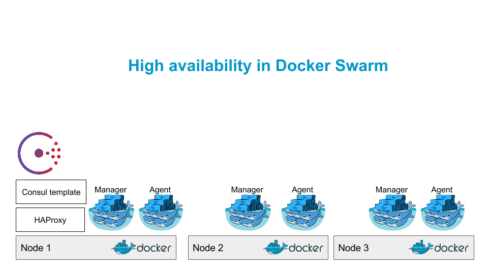

# ha-swarm

High availability in Docker Swarm



## Install Docker compose

```
export DOCKER_COMPOSE_VERSION=1.4.2

curl -L https://github.com/docker/compose/releases/download/$DOCKER_COMPOSE_VERSION/docker-compose-`uname -s`-`uname -m` > /usr/local/bin/docker-compose
chmod +x /usr/local/bin/docker-compose
```

## Replace node IP

```
sed -i 's/<consul_ip>/[CONSUL_IP]/g' docker-compose.yml
sed -i 's/<node_ip>/[NODE_IP]/g' docker-compose.yml
```

## Start Consul

```
docker-compose up -d consul
```

### Check Consul information

```
curl -v [CONSUL_IP]:8500/v1/kv/swarm?recurse
```

## Run Swarm Agent

```
docker-compose up -d swarm
```

## Run Swarm Agent

```
docker-compose up -d swarm
```
